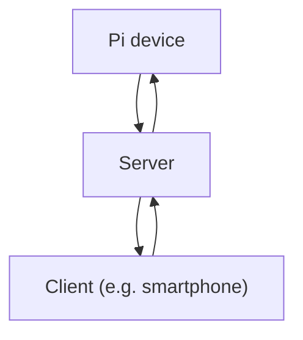

# Pi Security Camera

A project about a remote Raspberry Pi security camera.

## Main dependencies

- FastAPI
  - Includes Pydantic
- Requests for the Raspberry Pi (not installed yet)

## Structure

