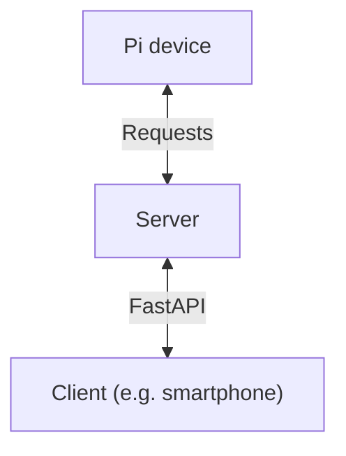

# Pi Security Camera

A project about a remote Raspberry Pi security camera.

## Main dependencies

- FastAPI
  - Includes Pydantic
- Requests for the Raspberry Pi (not installed yet)

## How to setup

### Server-side

1. Install `uv`

2. Run `uv sync` to install the required dependencies for the server side stuff

## Structure

