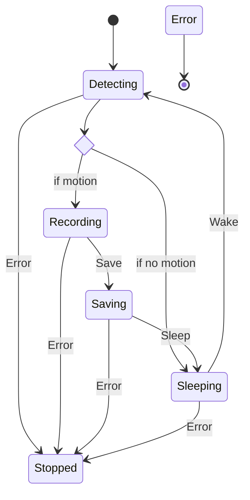

# Pi camera service

The main purpose of this project is to provide cheap remote surveillance where online connection is metered and limited.

All commands contain help menus that can be displayed with the `--help` flag.

## Motion detection service

This service records and transmits video to a remote server when motion is detected.

The motion detection service is modelled as a finite state machine (see below).



This system continues looping until the service is force-stopped (SIGINT) or an error occurs.

As this system has a sleep stage, the amount of data transferred can be massively reduced, which is ideal for metered mobile data plans.

You can run this service in the terminal with the following command:

```bash
uv run app/main.py serve --wait-time-ms 1000 --delta-ms 500 --video-length-s 5 --video-dir ./recordings --max-files 5
```

## Other commands

This CLI app also includes other useful commands for taking a photo or recording a video on demand.

```bash
uv run app/main.py record --seconds 10 --video-dir ./recordings
uv run app/main.py shoot --photo-dir ./photos
```
